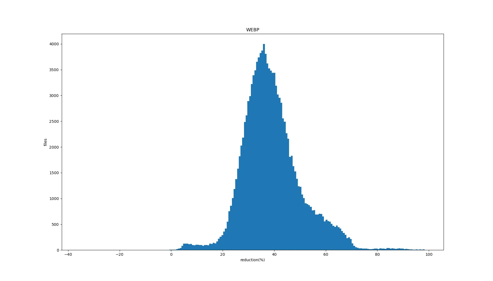
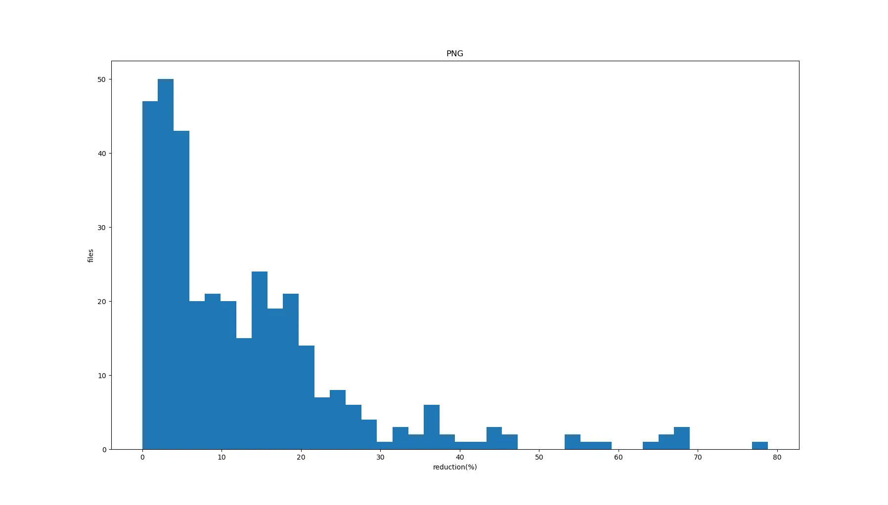

# Compressing PNG files even more
This repo has three simple scripts:

1. compressor.py
2. make_json.py
3. show_hists.py

Just run them in the sequence.

## compressor.py 

This script has one argument, a folder with png files. If none provided, it creates "originals" in current working directory and looks for files there on second run.

It will first try to analyze if a png is convertible to webp losslessly, first, by checking if the png is 8-bit or 16-bit per channel, and if it have gamma correction info without ICC color profile or sRGB intent.

If convertible, [custom build of cwebp](https://github.com/topin89/libwebp) will be used, that won't apply gamma if either the profile or the intent are in the file, all according to ~~keikaku~~ [PNG specs](https://www.w3.org/TR/2003/REC-PNG-20031110/#11gAMA).

If not, [ECT](https://github.com/fhanau/Efficient-Compression-Tool) is used to further squeeze the original file. By default, executables from *bin* are used, but you can easily change paths in the script.

Compressed files stored in "compressed" folder and after compression checked if pixel perfect same as original. That doesn't mean all information remains, e.g. color of fully transparent pixel can be different, and if alpha layer is 100% opaque for each pixel, it will be removed in compressed version. Also, for webp, besides color only XMP, EXIF and ICC metadata is saved, comments like "copyright" or "time" or e.g. preferred background color are not moved to webp. For 8-bit files, Pillow is used to compare, and for 16-bit,  custom [pypng](https://github.com/drj11/pypng) version with additional leniency for png chunk correctness.

If compressed image pixels are the same as the original, compressed file moved to "confirmed" folder. This way you can always see what files are not successfully processed and also won't recompress lots of files on every rerun.

## make_json.py

This script has the same arguments as *compressor.py*, used to collect info about file sizes and types of compressed files, making an array like this:

```json
[
    {
        "original_size": 74055,
        "compressed_size": 30420,
        "type": "WEBP"
    },
    {
        "original_size": 737905,
        "compressed_size": 456116,
        "type": "PNG"
    },
]
```

and writes them to *result.json* 

## show_hists.py

This script has two arguments, first is how many bars should be on webp histogram (200 by default), second is for png bars (50 by default), and processes *result.json* giving something like this:

```
total files: 129853
original size: 208.442490844056 GB
compressed size: 129.5298111755401 GB
total reduction: 37.85825018160697%
over 80% compression: 618 (0.4759227742139188%)
WEBP: 130814.8803062439 MB in 129502 files
PNG: 1823.6463375091553 MB in 351 files
```

And this:



